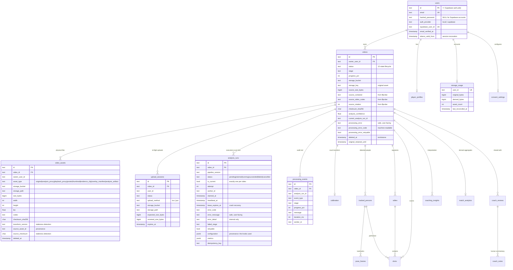

# Data model

> Migrations are authoritative. This document explains the shape and the
> reasoning; `backend/alembic/versions/` defines it.

---

## Entity relationships



---

## Why these four tables were added

**`video_assets`** — the MVP conflated the logical match with one file
(`videos.storage_path`). That holds until a video has an original, an analysis
proxy, a playback proxy, a poster, a thumbnail and evidence clips, each with a
different lifecycle, size and retention rule. Without this table there is no
way to do storage accounting, reconciliation or staleness detection at all.

**`analysis_runs`** — a video is not its analysis. Pipeline versions change,
and a user should be able to re-analyze a match without last month's numbers
being silently rewritten underneath them. This is also where the crash-recovery
lease lives, because "who is working on this and until when" is a property of
the execution, not of the video.

**`upload_sessions`** — coordinates application state with an in-flight object
upload. Stores no credential. It exists so that a refreshed browser, a crashed
tab or a second device can find out what was already in progress.

**`processing_events`** — an append-only trail so "what happened to this video"
is answerable after the fact. Deliberately coarse: one row per stage boundary
and per incident, so a 40-minute match produces roughly fifteen rows rather
than becoming the largest table in the database.

**`storage_usage`** — replaces `sum(Path(v.storage_path).stat().st_size ...)`,
which was O(videos) filesystem syscalls on a request path and returns zero the
moment the bytes live in a bucket.

---

## Data-capture layers

The product's analytical honesty depends on not mixing these up.

| Layer | Examples | Where it lives |
|---|---|---|
| **Source data** | video metadata, detected coordinates, pose landmarks, track observations | `pose_frames`, `tracked_persons`, `shuttle_frames`, plus the gzipped artifact |
| **Derived metrics** | movement score, technique score, tactical aggregates | `match_analytics`, `player_profiles`, computed scorecards |
| **Interpretation** | "you recover slowly to the backhand rear court" | `coaching_insights` |
| **Confidence** | per-insight and per-run reliability | `coaching_insights.confidence`, `videos.analysis_confidence`, `analysis_runs.metrics` |

### Provenance

A derived metric traces back through:

```
metric → analysis_runs.id
       → analysis_runs.pipeline_version
       → analysis_runs.configuration   (the exact sampling rates, budgets, media profile)
       → analysis_runs.source_asset_id → video_assets → checksum_sha256
       → the source observations that produced it
```

`configuration` is captured at run creation, not read from current settings at
display time — otherwise changing a default would retroactively rewrite the
provenance of every historical run.

---

## Where large analytical data lives

Decided by access pattern, not by preference.

| Data | Size | Access pattern | Storage |
|---|---|---|---|
| Video metadata, scores, status | bytes | queried, filtered, sorted | Postgres columns |
| Match analytics aggregates | ~10–50 KB | read whole, occasionally probed by block name | **JSONB** + GIN index |
| Rally phases, radar scores | ~1–5 KB | read whole | JSONB |
| Pose landmarks per frame | 10s of MB | read whole, never by content | **object storage** (in the gzipped artifact) |
| Full `PipelineResult` | 10s of MB gz | read whole, only on rehydration | **object storage** (`pipeline_result.json.gz`) |

Only the columns that are actually *queried* were made JSONB. The remaining
bulk columns stay plain `JSON`: they are read whole and written in bulk, so
binary conversion on insert would cost throughput for no query benefit.

### Pose landmarks are not in Postgres

`pose_frames` was the largest thing this system writes. At `POSE_SAMPLE_FPS=15`,
a 40-minute doubles match is ~72,000 rows carrying 33 landmarks each — roughly
**130 MB for one match**, or 133 GB per thousand matches, in a single table.

Nothing queries them by content. Every consumer (`/scorecards`,
`/overlay-manifest`, biomechanics) reads the entire sequence to rebuild one
object. The same data inside the gzipped artifact is about **76x smaller**.

So with `PERSIST_POSE_LANDMARKS=false` (the default), `pose_frames` keeps only
the small queryable columns — `frame_index`, `timestamp_s`, `confidence`,
`stance_label`, `balance_score` — and the landmarks live in
`artifacts/pipeline_result.json.gz`.

Two properties make that safe, and both are pinned by tests:

- The artifact is published **before** the decision is made. If the upload
  fails, the landmarks are written to Postgres after all, so the data always
  exists somewhere.
- `analysis_service.pose_samples_for()` resolves landmarks from the in-process
  cache, then the artifact, then the rows. A consumer cannot tell which store
  answered, so videos analyzed before the change keep working with no
  migration.

**Parquet was considered and not adopted.** It earns its keep on columnar
selective reads over large datasets. Every consumer here reads the entire
structure to rebuild one object, so Parquet would add a dependency and a schema
to maintain in exchange for nothing measurable. If per-frame analytics across
many matches ever becomes a feature, that is when the shape changes.

---

## Indexing

Composite indexes follow the actual `ORDER BY` in each endpoint, rather than
being added per-column out of habit:

| Index | Serves |
|---|---|
| `ix_videos_owner_created` / `ix_videos_live_owner_created` | the match library listing |
| `ix_videos_owner_status`, `ix_videos_status_updated` | dashboards, stuck-video sweeps |
| `ix_shots_video_timestamp` | `GET /videos/{id}/shots` |
| `ix_rallies_video_index` | `GET /videos/{id}/rallies` |
| `ix_insights_video_timestamp` | `GET /videos/{id}/insights` |
| `ix_pose_frames_person_frame` | scorecard reconstruction, the hottest sort |
| `ix_coach_reviews_coach_status` / `_video_status` | the review UI, and the RLS coach check |
| `ix_analysis_runs_active_lease` (partial) | the stale-lease sweep |
| `ix_match_analytics_gin` | JSONB block lookups |

The high-volume raw tables (`pose_frames`, `shuttle_frames`) get exactly the
one composite index their read path needs. Over-indexing a bulk-insert table
costs write throughput on every analysis.

### Constraints that are constraints, not conventions

```sql
uq_analysis_runs_one_current   -- exactly one current run per video
uq_video_assets_live_type      -- one live asset of each type per video
uq_video_assets_live_object    -- one live row per object key
uq_upload_sessions_active      -- one active upload session per video
ck_videos_progress_range       -- 0 <= progress_pct <= 100
```

"Which numbers are the real ones" is not a question that should be settled by
whichever concurrent writer committed last.
